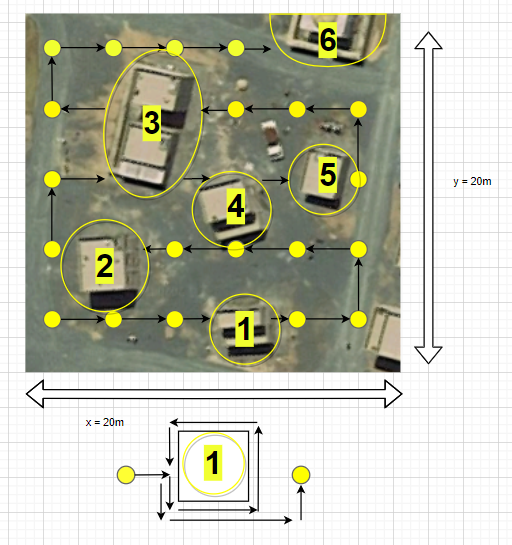

# SWAT-C Pathing Team
Tasked with introducing a tactically relevant path planning algorithm that will allow a robot to navigate an entire area while circumnavigating obstacles and buildings.

### Background:
Gazebo simulation software is a useful tool for visualizing a robot in a physical space. It is possible to drive that simulated robot autonomously or nonautonomously and see how it interacts with the virtual environment and how it perceives its world. The simulation software can also drive the physical robot in the same manner. This simulation software, then, applies perfectly to SWAT-C since it allows for efficiently testing a user-modeled robot with experimental capabilities than can then be extended to driving that physical robot in real-world scenarios.

### Concept:
The intent is to apply the Gazebo software to SWAT-C systems so that they are autonomously driven. Specifically, our goal is to direct a robot to autonomously navigate the entirety of a specified region, circumnavigate obstacles (especially buildings), and concurrently provide situational awareness to the operators by providing a video feed or some similar measure. Approaching this capability in this manner will abstract the problem for commanders who understand the effectiveness of human-robot integration while also relieving them from the burden of directing a robot's every move. Furthermore, the autonomy will free TOC operators from controlling specific robots and therefore allow them to manage other SWAT-C systems while simultaneously benefitting from the autonomous robot's situational awareness.

* Robot traverses yellow "nodes" until it sees a building.
* Circumnavigates and scans the building until it has a full image.
* Circumvents the building on the shortest path.
* Continues along nodes.
* If the building covers already established and not yet traversed nodes, those nodes will be removed, and the robot will circumvent the building when detects it in its path again.

### Problem:
Robot movement in Gazebo is largely a function of ROS nodes. Currently, no known ROS node exists that is intended for autonomously navigating regions and deliberately circumnavigating structures. If such a ROS does in fact exist, it is unlikely to apply directly to a military context wherein a robot is expected to navigate an outdoor region specified by a commander and provide meaningful situational awareness. The pathing team's experience in Gazebo, though limited, has demonstrated Gazebo's ability to move from point A to point B while avoiding simple obstacles; Gazebo has intelligent capabilities, but the pathing team must expand on them in order to make Gazebo more relevant to SWAT-C's operations.

### Assumptions:
Assume that the robot:
* Can physically traverse urban terrain (unimproved roads, dirt, moderate elevant changes, etc.).
* Is equipped with LiDAR --> it can detect 3D objects in its path. 
* Knows its geospatial data (has GPS).

### Google Maps Location:
https://www.google.com/maps/place/MCB+1,+Virginia/@38.5746155,-77.5453703,831a,35y,180h/data=!3m1!1e3!4m5!3m4!1s0x89b6f0eab69fc225:0x9e184fece89237ec!8m2!3d38.5448781!4d-77.4263075

